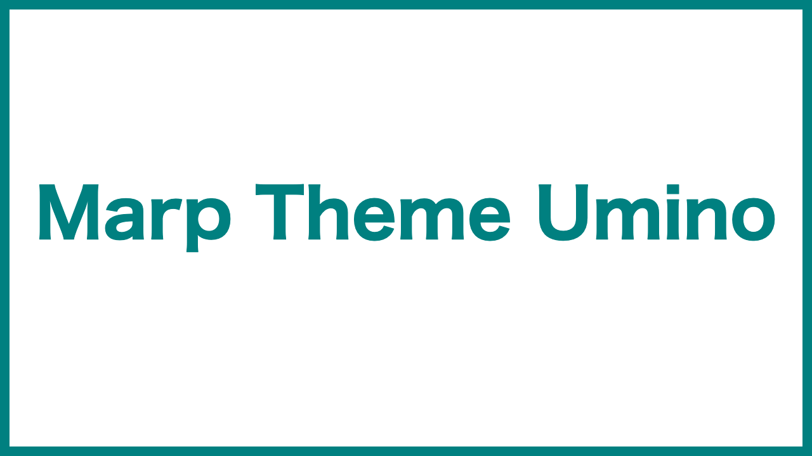
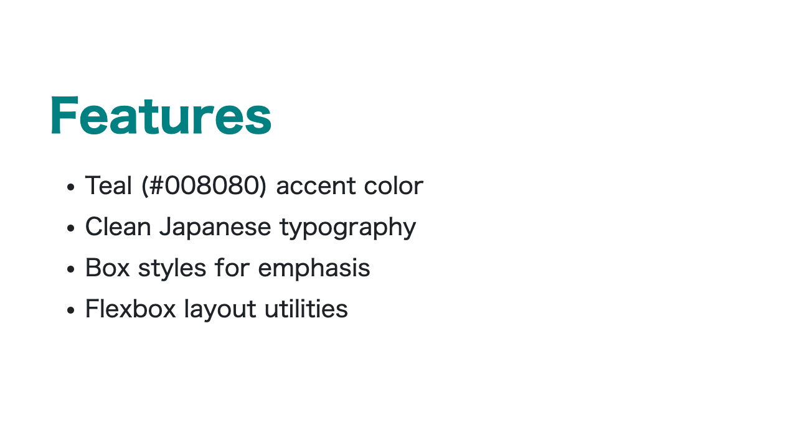
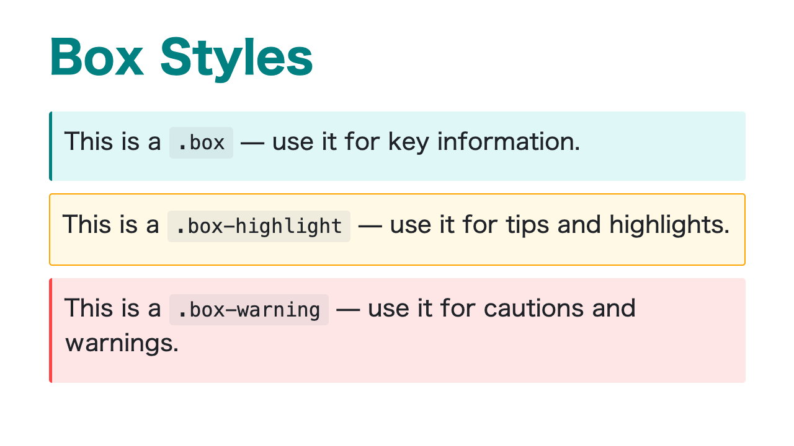
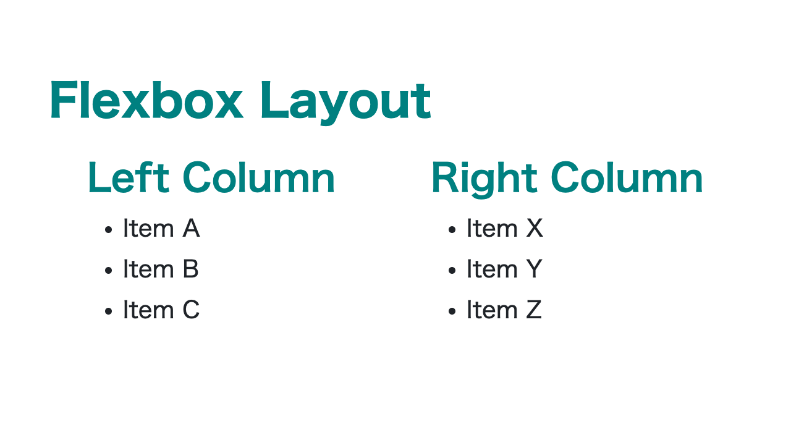
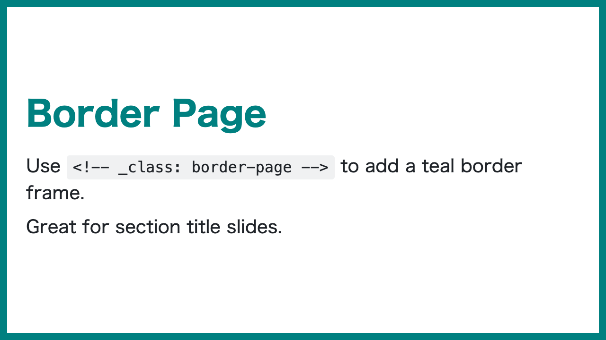
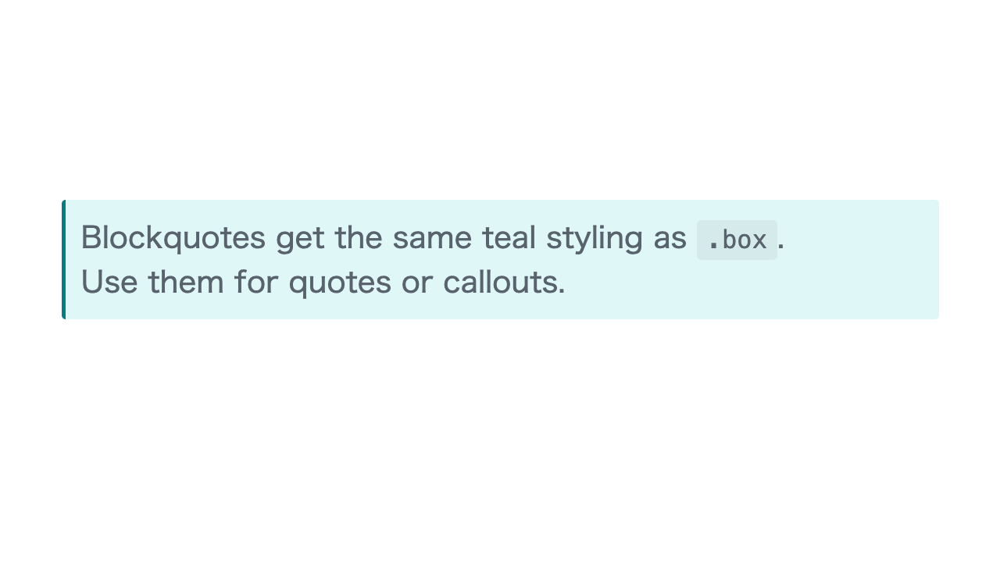

# Marp Theme Umino

日本語プレゼンテーション向けの、ティールカラーを基調としたクリーンな [Marp](https://marp.app/) テーマです。

## プレビュー

| タイトルスライド | コンテンツスライド | ボックススタイル |
|---|---|---|
|  |  |  |

| レイアウト | ボーダーページ | 引用ブロック |
|---|---|---|
|  |  |  |

## 特徴

- ティール (#008080) をアクセントカラーに使用
- 日本語フォント最適化（Hiragino Sans / Meiryo）
- ボックスコンポーネント: `.box`, `.box-highlight`, `.box-warning`
- Flexboxレイアウト: `.flex`, `.sa`, `.sb`, `.fw`
- タイトルスライド用のボーダースタイル: `border-page`

## インストール

### Marp CLI

```bash
marp --theme-set umino.css slide.md
```

### VS Code（Marp for VS Code）

1. `umino.css` をプロジェクトにコピー
2. `.vscode/settings.json` に以下を追加:

```json
{
  "markdown.marp.themes": ["./umino.css"]
}
```

3. Markdownファイルのフロントマターで `theme: umino` を指定

### Obsidian（Marp Slides プラグイン）

[Marp Slides](https://github.com/samuele-cozzi/obsidian-marp-slides) プラグインを使っている場合:

1. Vault内にテーマ用フォルダを作成（例: `Themes/Marp/`）
2. `umino.css` をそのフォルダにコピー
3. Obsidianの設定 → Marp Slides → **Theme Path** にフォルダパスを入力

```
Themes/Marp
```

4. Markdownファイルのフロントマターで指定:

```yaml
---
marp: true
theme: umino
---
```

5. コマンドパレットから「Marp Slides: Preview」でプレビュー確認

> **補足:** Theme Path はVaultルートからの相対パスです。`umino.css` のファイル名の先頭行 `/* @theme umino */` がテーマ名になります。

### PNG書き出し（CLI）

```bash
marp --no-stdin --html --theme-set umino.css --images png --allow-local-files --output "./slide.png" "スライド.md"
```

## 使い方

### 基本構成

```markdown
---
marp: true
theme: umino
paginate: true
---

# スライドタイトル<!--fit-->
<!-- _class: border-page -->

---

## コンテンツスライド

- ポイント1
- ポイント2
- ポイント3
```

### ボックススタイル

情報の種類に応じて3つのボックスを使い分けられます。

```html
<div class="box">
重要な情報やポイントの強調に
</div>

<div class="box-highlight">
ヒントやおすすめ情報に
</div>

<div class="box-warning">
注意事項や警告に
</div>
```

### Flexboxレイアウト（2カラム）

```html
<div class="flex sa">
<div>

左カラムの内容

</div>
<div>

右カラムの内容

</div>
</div>
```

| クラス | 説明 |
|--------|------|
| `.flex` | Flexboxを有効化 |
| `.sa` | `space-around` で均等配置 |
| `.sb` | `space-between` で両端配置 |
| `.fw` | `flex: var(--fw)` で等幅カラム |

### ボーダーページ

スライドに `<!-- _class: border-page -->` を追加すると、ティールの枠線が付きます。タイトルスライドやセクション区切りに最適です。

### タイトルの自動フィット

長いタイトルには `<!--fit-->` を使うと、スライド幅に合わせてサイズが自動調整されます。

```markdown
# 長いタイトルもフィットします<!--fit-->
```

## カラーパレット

| 用途 | 色 |
|------|-----|
| アクセント（見出し・ボーダー） | `#008080` (Teal) |
| ボックス背景 | `#E0F7F7` |
| ハイライトボーダー | `#FFA500` |
| 警告ボーダー | `#FF4444` |

## ライセンス

MIT
